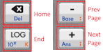

# MarkdownViewer para HP Prime

## ¡El Primer Visor de Markdown para tu Calculadora!

Lee documentos con formato Markdown directamente en tu HP Prime.
No se necesita PC. Ver también: [Demo de Enlaces](demo.md)

## Navegación



### Explorador de Archivos

- Toca un **encabezado de columna** para ordenar por esa columna
- Toca la **★** estrella en una fila para fijar/desfijar
- Toca **Recent** para ver archivos abiertos recientemente
- Toca **Theme** para cambiar entre tema claro/oscuro
- Presiona **Arriba/Abajo** para navegar por la lista
- Presiona **Enter** o toca un archivo para abrirlo
- Presiona **ESC** u **ON** para salir

### Visor de Documentos

- Presiona **Arriba/Abajo** para desplazarte línea por línea
- Presiona **+/-** para desplazarte página por página
- Presiona **Backspace** para ir al inicio
- Presiona **LOG** para ir al final
- Presiona **Izquierda** para volver (archivo anterior)
- Presiona **Derecha** para avanzar (archivo siguiente)
- Presiona **ESC** para volver al explorador de archivos
- Desliza en la **pantalla táctil** para desplazarte
- Presiona **ON** para salir

## Características

### Mejoras del Explorador de Archivos

#### Favoritos / Archivos Fijados

Toca el icono de estrella amarilla **★** en la columna
de estrellas de cualquier fila para fijar o desfijar.

Los archivos fijados muestran una **★** estrella amarilla.
Al ordenar por la columna de estrellas, los favoritos
aparecen primero. Los favoritos se mantienen al reiniciar.

#### Archivos Abiertos Recientemente

Toca **Recent** en la barra de menú (o presiona **F1**)
para ver la lista de tus últimos 10 archivos abiertos.
Selecciona uno para abrirlo directamente.

#### Ayuda

Toca **Help** en la barra de menú (o presiona **F5**)
para abrir este archivo de ayuda. La aplicación
selecciona automáticamente una versión traducida
si está disponible (ej. `help_es.md` para español).

#### Ordenar por Columnas

El explorador tiene tres columnas ordenables:

- **★** (Estrella) — ordenar favoritos primero
- **Name** — ordenar alfabéticamente
- **Size** — ordenar por tamaño de archivo

Toca un encabezado de columna para ordenar por él.
Toca el mismo encabezado de nuevo para invertir el orden.
La columna activa muestra **▲** (ascendente)
o **▼** (descendente).

#### Organización de Archivos

Para organizar muchos archivos, usa la convención
de nombres con guion bajo: `carpeta_archivo.md`.
El explorador los muestra como `carpeta/archivo.md`
para agruparlos visualmente. Los archivos con un
prefijo común se ordenan juntos naturalmente.

Por ejemplo, el archivo incluido `docs_lorem.md`
aparece como `docs/lorem.md` en la lista. Puedes
crear múltiples "carpetas" de esta manera:

- `notas_mate.md` → `notas/mate.md`
- `notas_fisica.md` → `notas/fisica.md`
- `docs_config.md` → `docs/config.md`

Esto es solo una convención de visualización — todos
los archivos permanecen en el mismo directorio de la
aplicación en la calculadora.

#### Etiquetas de Archivos

Mantén presionado un archivo en el explorador para
asignar una categoría de color. Etiquetas disponibles:

- **Ninguna** — sin etiqueta (por defecto)
- **Matemáticas** — punto azul
- **Ciencias** — punto verde
- **Notas** — punto naranja
- **Trabajo** — punto rojo
- **Personal** — punto morado

Los archivos etiquetados muestran un pequeño punto
de color antes del nombre. Las etiquetas se guardan
entre reinicios de la aplicación.

### Renderizado de Texto Enriquecido

- **Texto en negrita** para énfasis
- *Texto en cursiva* para estilo
- `Fragmentos de código` para documentos técnicos
- ~~Texto tachado~~ para contenido eliminado
- [Enlaces](https://example.com) mostrados en color
- Encabezados de H1 a H6

### Citas

> Esto es una cita.
> Puede abarcar varias líneas.

>> Las citas anidadas también son compatibles.

### Listas

Listas con viñetas:
- Primer elemento
- Segundo elemento
  - Elemento anidado
  - Otro elemento anidado
    - Anidamiento aún más profundo

Listas numeradas:
1. Primer paso
2. Segundo paso
  1. Sub-paso
  2. Otro sub-paso

### Listas de Tareas

- [x] Tarea completada
- [ ] Tarea pendiente
- [x] Otro elemento terminado

### Tablas

| Función | HP Prime | Python |
|---|---|---|
| Imprimir | PRINT() | print() |
| Entrada | INPUT() | input() |
| Esperar | WAIT() | time.sleep() |

### Fragmentos de Código

El código en línea como `viewer.render()` se resalta.

Los bloques de código también son compatibles:

```
from markdown_viewer import MarkdownViewer
viewer = MarkdownViewer(0)
viewer.load_markdown_file("help.md")
viewer.render()
```

### Fórmulas Matemáticas

Usa un bloque de código etiquetado con `math`, `formula`
o `cas` para mostrar expresiones CAS en formato legible:

```math
integrate(sin(x)^2,x)
```

```math
sum(1/n^2,n,1,infinity)
```

Cada línea dentro de un bloque math se convierte en una
fórmula formateada independiente, centrada con un borde.
Las dimensiones de las fórmulas se almacenan en caché
para un desplazamiento rápido.

Las funciones CAS compatibles incluyen `integrate`, `sum`,
`diff`, `limit`, `sqrt`, `matrix` y cualquier expresión
CAS válida de HP Prime.

## Búsqueda

Toca **Find** en la barra de menú para buscar texto.
Toca **Next** para saltar a la siguiente coincidencia.
El texto encontrado se resalta en el documento.

## Tabla de Contenidos

Toca **TOC** en la barra de menú (o presiona **F4**)
para ver una lista de todos los encabezados del documento.
Selecciona un encabezado para ir directamente a esa sección.

## Menú Más

Toca **More** en la barra de menú (o presiona **F5**)
para acceder a configuraciones y herramientas adicionales:

### Tamaño de Fuente

Cicla el texto del cuerpo entre **10px**, **12px** y
**14px**. Los encabezados se escalan proporcionalmente.
Esta configuración aplica a la sesión actual.

### Ajuste de Línea

Alterna el ajuste de línea **ON** u **OFF**. Cuando
está desactivado, las líneas largas se recortan en el
borde derecho en lugar de pasar a la siguiente línea.
Útil para documentos con mucho código.

### Vista Dividida (Panel TOC)

Alterna un mini panel de tabla de contenidos en la
parte superior de la pantalla. Muestra hasta 5
encabezados alrededor de tu posición actual, con
la sección activa resaltada. Toca un encabezado
en el panel para ir a esa sección.

### Ir a %

Salta a una posición específica del documento
ingresando un porcentaje (0–100). Útil para navegar
rápidamente documentos largos.

### Atajos de Teclado

Muestra una ventana con todos los atajos de teclado
disponibles en el visor. Presiona cualquier tecla
o toca para cerrar.

### Info del Documento

Ver estadísticas del documento:
- Nombre del archivo
- Cantidad de líneas
- Cantidad de palabras
- Tiempo estimado de lectura

### Avanzar

Cuando esté disponible, navega hacia adelante en tu
historial de navegación (después de usar navegación
hacia atrás).

## Secciones Plegables

Toca un **encabezado** en el documento para colapsar
o expandir su contenido. Los encabezados colapsados
muestran un indicador **▶**; los expandidos muestran **▼**.

Todo el contenido bajo el encabezado (hasta el siguiente
encabezado de igual o mayor nivel) se oculta cuando
está colapsado. Funciona para todos los niveles (H1–H6).

## Enlaces Internos

Los enlaces a otros archivos `.md` (ej. `[Ver config](config.md)`)
son interactivos. Toca para abrir el archivo enlazado.
Presiona **Izquierda** o **ESC** para volver al archivo anterior.
Presiona **Derecha** para avanzar de nuevo.
Se admiten múltiples niveles de navegación atrás/adelante.

## Progreso de Lectura

Se muestra un indicador de porcentaje en la parte inferior
de la pantalla, indicando cuánto has avanzado en el
desplazamiento del documento.

Tu posición de desplazamiento se guarda por archivo,
así que al reabrir un documento, continúas justo
donde lo dejaste.

## Temas

Toca **Theme** en la barra de menú para alternar entre
temas claro y oscuro. Funciona tanto en el explorador
de archivos como en el visor de documentos.

## Marcadores

Mantén presionado en cualquier parte del documento para
abrir un menú contextual con las siguientes opciones:

- **Add Bookmark** — guardar la posición actual
- **Copy Line** — copiar la línea en esa posición al
  portapapeles PPL (accesible vía `AVars("Clipboard")`)
- **Tag** — ciclar la categoría de etiqueta del archivo

Los marcadores aparecen como **marcas rojas** en la
barra de desplazamiento.

Toca **Marks** en la barra de menú para abrir el
administrador de marcadores donde puedes:
- Ir a cualquier marcador guardado
- Eliminar marcadores que ya no necesites

Se admiten múltiples marcadores por archivo y se
almacenan automáticamente.

Tu último archivo abierto y la posición de desplazamiento
también se guardan automáticamente. Cuando vuelves al
explorador de archivos, tu último archivo se marca con
un triángulo.

## ¿Por qué MarkdownViewer?

Este es el *primer* visor de Markdown construido
completamente en MicroPython para la calculadora
gráfica HP Prime.

### Soporte de Imágenes

Las imágenes se pueden incrustar usando datos de
píxeles crudos codificados en base64:


O cargadas directamente desde un archivo:


Escribe tus notas, documentos y guías en Markdown
estándar en tu PC, cópialos a tu calculadora y
léelos en cualquier lugar.

¡No más entrecerrar los ojos con archivos de texto plano!

## Primeros Pasos

1. Coloca tu archivo `.md` en la carpeta de la aplicación
2. Inicia MarkdownViewer
3. Desplázate y lee

*¡Disfruta tus documentos en cualquier lugar!*

---

*Hecho con amor por Andrea Baccin*
